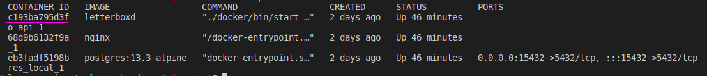

# LetterFake
## [Video do projeto LetterFake](https://drive.google.com/file/d/1wts2voPos7j3guxRpidMIDeGsoxs5feC/view?usp=share_link)

LetterFake é um projeto inspirado no site LetterBoxd, onde o usuário pode adicionar filmes ou séries que já assistiu e indicar se viu, quer ver ou se não tem interesse. Além disso, é possível adicionar tags, categorias, comentários e imagens aos filmes e séries cadastrados.

## Funcionalidades

- Adicionar filmes ou séries;
- Visualizar lista de filmes e séries cadastrados;
- Editar filmes ou séries já cadastrados;
- Remover filmes ou séries cadastrados;
- Adicionar tags, categorias, comentários e imagens aos filmes e séries cadastrados.

## Tecnologias

Este projeto foi desenvolvido utilizando as seguintes tecnologias:

- Python
- Django
- HTML
- CSS
- JavaScript
- PostgreSQL

## Como executar o projeto

Para executar o projeto, é necessário ter o Docker e o Docker Compose instalados em sua máquina. Com essas ferramentas instaladas, siga os passos abaixo:

1. Clone este repositório em sua máquina;

2. Navegue até o diretório raiz do projeto;

3. Inicie os containers com o comando `docker-compose build` e depois `docker-compose up`;

4. Depois que os containers tiverem rodando em outro terminal de o comando: `docker-ps` e pegue o id do container

5. Depois de salvar o id do container, rode o seguinte comando: `docker exec -it ID DO CONTAINER /bin/bash`. Esse comando serve para entrar no container do projeto e depois disso rode: `./manage.py createsuperuser`

6. Nesse momento você irá criar um super-usuário, adicione suas credenciais e é importante ser algo que você lembre ou algo como:

- name: admin
- email: admin@admin.com
- senha: adminadmin

**Observação:** O projeto atualmente não possui um sistema de cadastro de usuários, então é necessário criar um usuário administrador usando o comando acima para ter acesso à área de administração e ao API.

7. Feito isso, ainda dentro do container rode `./manage.py migrate` para gerar as tabelas do banco de dado

8. Com o usuario criado e as migrações criadas, acesse o projeto em ´localhost/inicio´, faça login com o usuário criado e adicione/edite/exclua os filmes e séries que quiser! 

Para parar os containers, basta executar o comando `docker-compose down`.

 **Observações:**
- O projeto atualmente não tem apimock, mas possui o JSON Server integrado para fornecer os dados de exemplo.
- Verifique o arquivo `.env` para ver as variáveis de ambiente necessárias.

####  **Créditos**
- Template Original [Djavue](https://github.com/evolutio/djavue): [Tony Lâmpada](https://github.com/tonylampada)
- Template [Djavue3](https://github.com/huogerac/djavue): [Roger Camargo](https://github.com/huogerac)